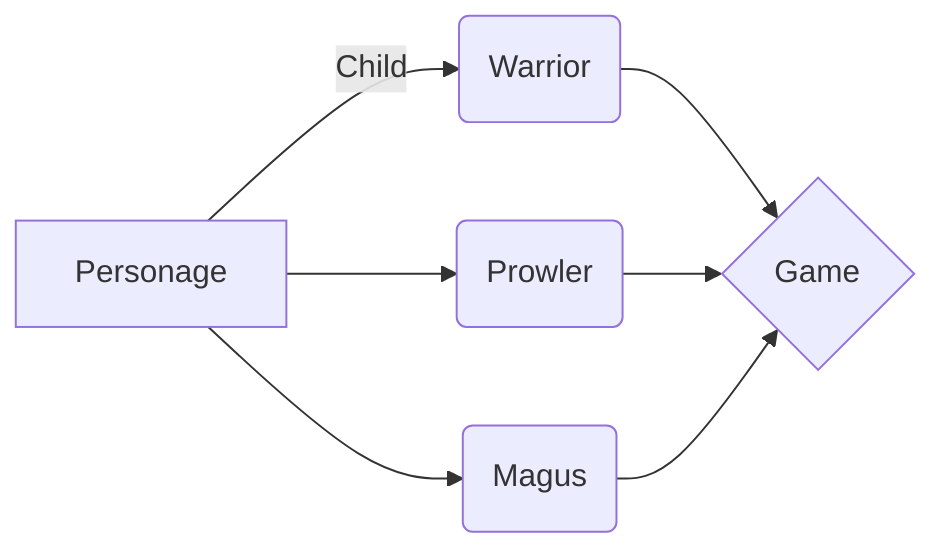

# Welcome to MagiWorld!

## Specifications

In this project, Create an epic battle game between Warrior, Ranger and Mage.

This game is intended for 2 players and works in the terminal.

## How is the game

The game begins by proposing to the player 1 to choose between Warrior, Ranger or Mage.
He must then choose the level, the strength, the agility and finally the intelligence of his character.
It is then the turn of the second player to choose the class and characteristics of his character.
The game starts then, player 1 starts.
Each player plays alternately and chooses between his Basic Attack or his Special Attack.
When a player has no life, the game ends and the other player wins.

## Characteristics

Each character has 5 characteristics:

- Level: chosen by the player (min 1, max 100)
- Life: equal to the player's level * 5
- Strength: chosen by the player (min 0, max 100)
- Agility: chosen by the player (min 0, max 100)
- Intelligence: chosen by the player (min 0, max 100)
>Attention the total force + agility + intelligence must be equal to the level of the player.

For example, a level 18 mage can not have 5 strength and 14 intelligence: the total is 19 and not 18.

Attack :
Each player has 2 spells :

- A basic attack that causes damage to the opponent.
- A special attack with varied effects.

Here are the details of the spells:


Warrior
- Basic Attack - Sword Blow: Performs damage equal to the player's strength on the opponent.
- Special Attack - Rage Shot: Performs damage equal to the player's two-time force on the opponent. The player launching the attack loses vitality: the value of his force divided by 2.

Prowler
- Basic Attack - Archery: Performs damage equal to the agility of the player on the opponent.
- Special Attack - Concentration: The player gains his level divided by 2 in agility.

Magus
- Basic Attack - Fireball: Performs damage equal to the player's intelligence on the opponent.
- Special Attack - Care: The player heals his life and regains his intelligence amount 2 times in life. Be careful, he can not have more life than he had at the beginning.

Polymorphism:



Behavior - Pattern Strategy:

```mermaid
graph LR
z{InterfacePersonageAttack} -- implements--> A
A{PersonageAttack} -- Child --> B(AttackWarrior)
A --> C(AttackProwler)
A--> D(AttackMagus)
B --> e{Personage}
C --> e{Personage}
D --> e